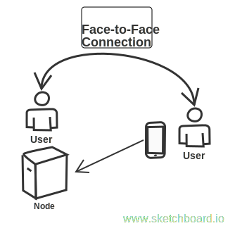
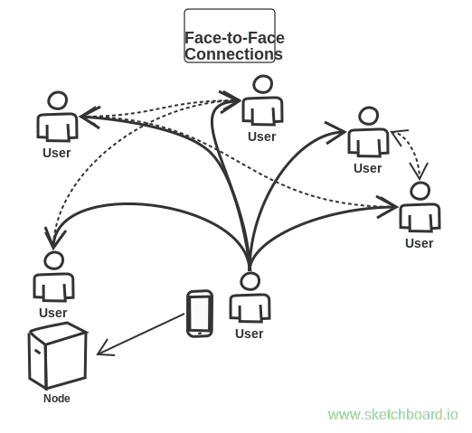
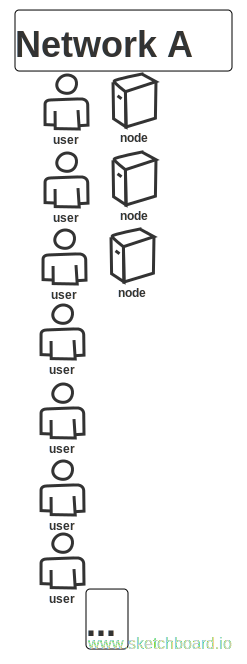
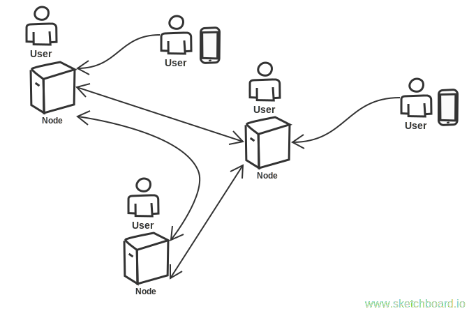

# Brightside 
Brightside is a public [distributed ledger](https://en.wikipedia.org/wiki/Distributed_ledger) secured by a social graph of face-to-face connections instead of a blockchain (proof-of-work or proof-of-stake).

### Unique Identity of Users is Fundamental
As a side-effect of its security model, Brightside maintains in its ledger a set of public keys representing unique individuals.  Applications built on Brightside have access to this set.  This makes Brightside a good fit for applications where each user represents a unique person--such as self-sovereign identity, self-managed medical and credit histories, property registries, universal basic income distribution, charities, and voting systems.

### Appropriate Scale
Applications built on Brightside have their own ledger space, visible (raw or encrypted), but not alterable by other applications.  Each application is a [replicated state machine](https://en.wikipedia.org/wiki/State_machine_replication) operating within its own ledger space.  Brightside nodes can run any combination of applications, allowing application networks of different sizes.  This allows applications to achieve (but not exceed) the scale they need.  Applications can be written in any language, connecting to the ledger through a local API.

## Operational Overview
A social graph of connected users is central to both the security and the operation of Brightside.

When a new user joins, they must find a real-world contact who's running a node.

From there, they can expand their network by adding real-world connections

### Whitelist (stamp of uniqueness)
Once a user's network has enough of the right kind of connections to be considered unique by graph analysis, they're added to the *whitelist*.  The whitelist is the set of users considered by the system to be unique.

Users not on the whitelist can still benefit from using the network, but they may be excluded from certain application-specific privileges such as receive a basic income disbursement.

### Running a node
Anyone on the whitelist can run a node.  They should have a computer that can stay connected to the internet.  The software is installed using a simple installer.  Network and hardware requirements are typical of those of a home computer.

Running a node is very valuable because it allows more users to join the network; a new user must already know someone who's running a node.

Nodes communicate with other nodes, store the social graph information, and receive updates to the graph (signed attestations of face-to-face connections) from clients.

Each node can run a different set of application modules.  For instance, Node A could run a voting module and an id service, while Nodes B and C could support a universal basic income currency ledger.

---
### Architecture
Consensus between nodes is mediated by [SCP (Stellar Consensus Protocol)](https://www.google.com/url?sa=t&rct=j&q=&esrc=s&source=web&cd=1&cad=rja&uact=8&ved=0ahUKEwij5cvx4LbWAhWi5lQKHXGpCoAQFggtMAA&url=https%3A%2F%2Fwww.stellar.org%2Fpapers%2Fstellar-consensus-protocol.pdf&usg=AFQjCNFDrsjJtP5IbB05TRfIQqARqDCr-A).  Other pieces of [stellar-core](https://github.com/stellar/stellar-core) are being considered for inclusion.

We're still in the early stages of [making architectural decisions](ARCHITECTURE.md).

If you're interested in contributing, please [start a new Issue](https://github.com/adamstallard/brightside/issues) and we'll add you to the conversation.
