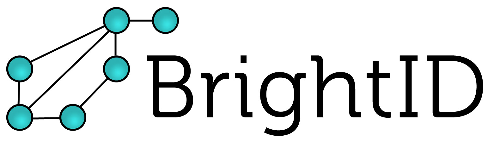

[💬 Join our active community on decstack](https://hub.decstack.com/signup_user_complete/?id=wutow3kb6bda5bhptir6aapyfh) channel: BrightID

[🌐 www.brightid.org](http://www.brightid.org)

BrightID uses the people you know (a social graph) to keep out duplicates and enforce one-account-per-person for important applications like voting and universal basic income.

Unlike most IDs--which prove who you are--a BrightID proves that you're a unique person.

BrightIDs have the following characteristics:
* Can be used anonymously. No data is stored. Personal data or biometrics aren't used for verification.
* Verified by a trusted group of close personal contacts plus a [decentralized social graph owned by no one](#decentralized-and-owner-free).
* A lost or compromised ID can be replaced by reconnecting with a few close personal contacts.
* Proof of world-citizenship.

## Decentralized and Owner-Free

There's no organization controlling BrightID. The network consists of volunteers [running nodes](https://github.com/BrightID/BrightID-Node).  Nodes host the social graph used for verification, but there's no personal information stored there.

## Mobile App

ID creation and connectons to people and apps are managed though the [BrightID mobile app](https://github.com/BrightID/BrightID/wiki/BrightID---Full-Mobile-Spec).

## API for Businesses

[We offer an API to third-parties](https://github.com/BrightID/BrightID-API) to connect to the BrightID mobile app and BrightID nodes to verify users as unique.

## Contribute

### KanBans
[Mobile project](https://github.com/BrightID/BrightID/projects/2 )

[Node project](https://github.com/BrightID/BrightID-Node/projects/1)

[Documentation project](https://github.com/orgs/BrightID/projects/2)

### Repos
This repo is for the [BrightID mobile app](https://github.com/BrightID/BrightID/wiki/BrightID---Full-Mobile-Spec).
See our [dev setup](https://github.com/BrightID/BrightID/wiki/Development-Guide) for instructions on how to run the application.

Other repos
* [BrightID Node](https://github.com/BrightID/BrightID-Node): A node hosting the BrightID social graph
* [BrightID API](https://github.com/BrightID/BrightID-API): APIs allowing third-party apps to verify users

## Discuss

We have an active community on [Decstack](http://decstack.com/)--Join the conversation at [the Decstack projects team](https://hub.decstack.com/signup_user_complete/?id=wutow3kb6bda5bhptir6aapyfh), channel: https://hub.decstack.com/projects/channels/brightid.
