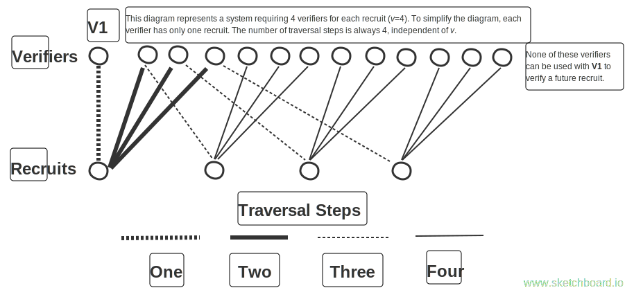

## Motivation

The number of sybil (fake, duplicate) accounts from which a group of malicious users can benefit should be limited. To this end, each account must be *verified* to perform important functions like running a node, or to receive benefits that require a unique identity, such as basic income from a basic income distribution application. This is done by analyzing the social graph.

## Verification Process

Accounts are verified when _k_ (a constant agreed upon by the network) accounts that are already verified have made a connection to the account (with an additional non-combining restriction, outlined below). The newly-verified account is known as a _recruit_ and the accounts used to verify it are known as _verifiers_.

A potential recruit submits the identities (public keys) of the proposed verifiers to the network which checks that the needed connections exist and also checks the non-combining restriction.  If these checks pass, the account is marked as verified and listed as a recruit of each of the verifiers.

The non-combining restriction is as follows. Each verifier has a set of other verifiers with which it can't combine to verify a recruit: these are its _non-combinable-verifiers_. The set of non-combinable-verifiers for verifier __V1__ is created by starting with __V1__, traversing the paths connecting recruits and verifiers for exactly four steps[^1], and adding all the verifiers encountered.



(The verifiers along the top row of the figure make up the set of non-combinable-verifiers for verifier __V1__)

It's the responsibility of a potential recruit (or a client program acting on her behalf) to find and submit verifiers that pass the restriction; the network is then responsible for checking them.  The network can be queried for any account's non-combinable-verifiers to help with this process.

##Limits to Attackers

The number of sybils a group of colluding attackers can verify is 

```math
\lceil \frac{n}{k-1} \rceil -1 ; k >= 2
```

without reusing new sybils for verification, and

```math
\lceil \frac{n}{k-2} \rceil -1 ; k >= 3
s = ceil(n/(k-2))-1 ; k >= 3
```

when reusing new sybils for verification, where _k_ is the network constant representing the number of verifiers required per recruit and _n_ is the number of colluding attackers.

For example, for values _k_ = 4 and _n_ = 300, 99 sybils could be verified initially and 149 total if the new sybils are reused for verification.

When _k_ >= 3, _s_ will be less than _n_, meaning each attacker will receive less than one sybil account.  This means that to share the benefits of the attack, attackers must continue to collude and share accounts, making the attack more difficult.

[^1] Adding more than four steps doesn't additionally limit the number of sybils a group of attackers can verify.<sup>[Proof needed]</sup>